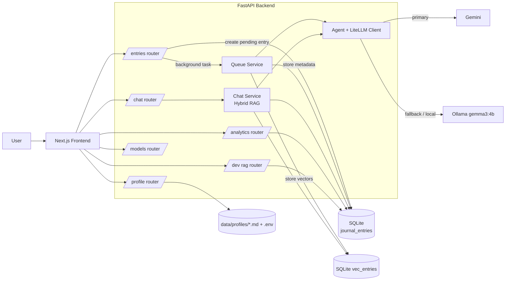
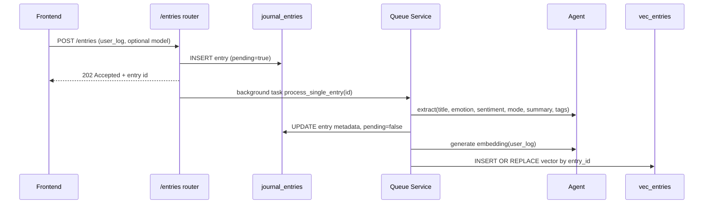
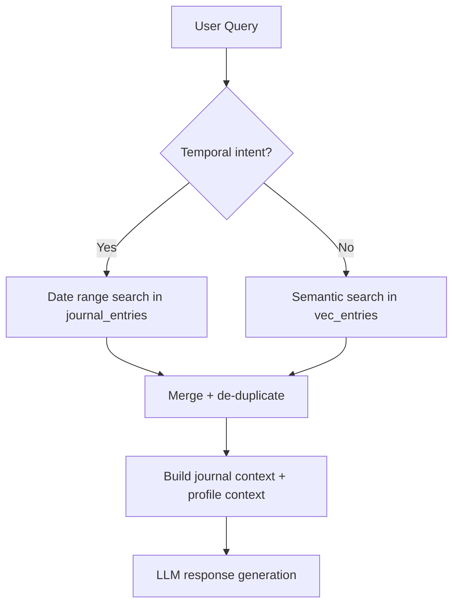
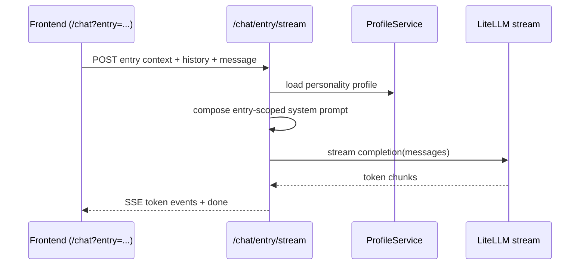
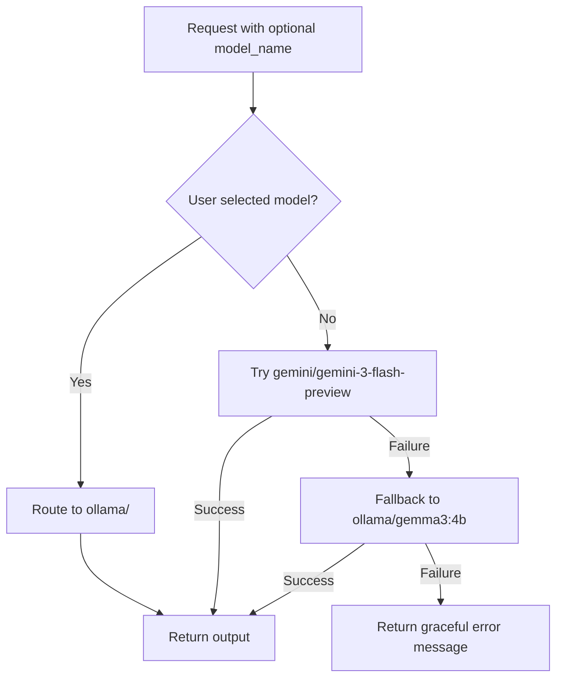

<p align="center">
  
</p>

<h1 align="center">manasCore - Your Inner Journal</h1>

<p align="center">
  
  
  
  
  
  
</p>

## About The Project

manasCore is a local-first AI journaling app designed to help users reflect clearly, build consistent self-awareness, and track growth over time with private journaling workflows that can run on-device while still supporting cloud AI when needed.

- Chat with your journal using local RAG for context-aware, memory-backed reflections.
- Local-first architecture that keeps the core journaling experience reliable on your machine.
- Intelligent fallback mechanism that maintains continuity across local and cloud model routes.
- Optimized runtime for low-parameter local models to keep performance practical on everyday hardware.
- Complete privacy-first storage with journal data persisted locally by default.
- Full ownership of your journal data, with no forced external dependency for your core experience.

## Product Showcase

| Home Page | Chat with Journal | Dashboard |
| --- | --- | --- |
|  |  |  |
| The home page is your focused entry point to capture thoughts quickly and start daily reflection without friction. | The chat page lets you talk to your journal with local RAG-backed context, so responses stay relevant to your own history. | The dashboard gives you a clear view of mood patterns, consistency, and long-term progress across your journaling journey. |

## Quick Start

1. **Download and install Ollama** from [ollama.com/download](https://ollama.com/download).
2. **Pull the recommended local model (`gemma3:4b`)**:
   ```bash
   ollama pull gemma3:4b
   ```
3. **Ensure Ollama is running** in the background.
4. **Install `uv`** (required for backend dependencies):
   - macOS/Linux:
     ```bash
     curl -LsSf https://astral.sh/uv/install.sh | sh
     ```
   - Windows:
     ```powershell
     powershell -ExecutionPolicy ByPass -c "irm https://astral.sh/uv/install.ps1 | iex"
     ```
5. **Install app dependencies** from the project root:
   ```bash
   npm run install:all
   ```
6. **Run the app**:
   - Development:
     ```bash
     npm run dev
     ```
   - Production:
     ```bash
     npm start
     ```

## How to Run

1. **Install dependencies** (from the project root):

   ```bash
   npm run install:all
   ```

2. **Start the full app in development (frontend + backend)**:

   ```bash
   npm run dev
   ```

3. **Start the full app in production (recommended)**:

   ```bash
   npm start
   ```

Both unified commands start:
- **Frontend (Next.js):** http://localhost:3000
- **Backend (FastAPI):** http://localhost:8000

Open `http://localhost:3000` in your browser to begin your journaling journey!

## System Architecture

manasCore is a Next.js + FastAPI local-first system where journal entries are written immediately to SQLite, processed asynchronously for AI metadata and embeddings, and then reused through a hybrid RAG chat pipeline (temporal + semantic retrieval) with LiteLLM-based model routing between Gemini and local Ollama.

- `frontend/src/lib/api.ts` is the typed API contract for journal CRUD, chat streaming (SSE), analytics, profile/config, and dev RAG lab endpoints.
- `backend/routers/*` exposes domain APIs (`/entries`, `/chat`, `/analytics`, `/profile`, `/models`, `/dev/rag`).
- `backend/services/queue.py` runs async post-processing: extract title/emotion/sentiment/tags + generate/store embeddings.
- `backend/services/chat.py` performs hybrid retrieval from `journal_entries` + `vec_entries` and builds grounded chat context.
- `backend/agent/llm_client.py` handles model routing and fallback (`Gemini -> Ollama`) for generation, streaming, and embeddings.
- Data is local by default: SQLite (`journal_entries`, `vec_entries`) plus local markdown profile files in `data/profiles`.



### Low-Level Design

#### Queue Service (Async Entry Processing)

When a user creates a journal entry, the backend stores it immediately with `pending=true` and returns fast. Background processing then extracts structured metadata and stores embeddings without blocking the user experience.



#### Hybrid RAG (Temporal + Semantic Retrieval)

The chat retrieval layer first checks temporal intent (for queries like "this week", "last month", "from X to Y"), then merges date-filtered entries with vector similarity results from `sqlite-vec`, and builds a grounded context block for the LLM.



#### Chat with Individual Journal Entry

For entry-focused chat, the frontend sends entry content and metadata directly to `/chat/entry/stream`. The backend builds a scoped system prompt around that single entry and streams tokens back over SSE.



#### Default and Fallback Model Routing

Model routing is centralized in `backend/agent/llm_client.py`: Gemini is the default path, local Ollama is fallback for failures, and explicit user model selection can force local routing.



## Tradeoffs & Decisions

### 1. Model Routing Strategy

The default model was set to `gemini-3-flash` because Google AI Studio offers a generous free tier, Gemini API keys are easy to obtain, and the model is fast and strong for general reasoning.  
The tradeoff is clear: defaulting to cloud inference can conflict with a strict local-first philosophy.

To balance this, a model selector was implemented so users can run any Ollama model already available on their device. A strict local fallback was also added to `gemma3:4b`, chosen after development testing where it delivered strong quality-to-speed performance on low-memory systems (including around 4 GB RAM), while models like `qwen3` and `llama` variants were often heavier or slower in practice.

As model availability improved, `nemotron-mini-3` also became a recommended option due to strong journal understanding and fast inference. Ollama cloud routes are additionally useful when users want managed access with generous limits.

### 2. LiteLLM Over LangGraph

`litellm` was selected as the inference abstraction layer because it is lightweight and provider-flexible (Gemini, OpenAI, Claude, Ollama, and others) without adding large orchestration overhead.

The tradeoff was not using framework-heavy agent orchestration (for example, LangGraph). This was an intentional decision to keep the runtime simpler, faster to maintain, and easier to extend with new model providers.

### 3. Database Selection (SQLite + sqlite-vec)

The system needed to be local-first, lightweight, and fast for vector retrieval. While a stack like Postgres + pgvector (often with Docker) was considered, SQLite was chosen for native Python compatibility, low operational cost, and single-file local portability.

`sqlite-vec` made this choice stronger by enabling vector search inside the same database, using a virtual vector table (`vec_entries`) linked to journal entries. This avoided introducing a separate vector database process.

### 4. Backend Framework Choice (FastAPI)

FastAPI was selected because it is fast, async-friendly, type-safe, and integrates cleanly with Python services already used in the project.

This supported a practical architecture: quick API development, background queue tasks, and streaming chat endpoints (SSE) with minimal friction.

### 5. Hybrid RAG Evolution

The first version used semantic RAG only (`top-k` similarity retrieval), which worked well for general reflective prompts but underperformed for temporal queries such as:

- "Analyze my last week."
- "Compare me from my day 1."

These queries require date-scoped recall first, not just semantic similarity. The pipeline was upgraded to hybrid retrieval:

- temporal intent detection via regex/date parsing,
- explicit date-range filtering from `journal_entries`,
- semantic retrieval from vectors,
- merged and de-duplicated results with temporal priority for temporal queries.

This significantly improved retrieval relevance and response quality for reflection-over-time questions.

### 6. Prompt Composition Decision

Before final generation, prompts are assembled in a deliberate order:

1. personality
2. vision
3. goals
4. retrieved journal context
5. user message

This ordering makes the assistant less generic and more directional, so responses are grounded in the user's history and aligned with long-term self-correction rather than one-off chat replies.

## Philosophy & Vision

I became deeply obsessed with journaling because I believed in this idea: _"The fastest way to change is to obsessively reflect back on your life and do not lie to yourself about what life it is creating."_ ~ Dan Koe.

But I learned that writing consistently is only one part of the problem. Journaling was easy to start, yet often overwhelming to continue. I struggled to articulate what I truly felt, and even when emotions were loud in my head, I could not turn them into action. Over time, my journal became messier, and the same question kept returning: what now, and where is the feedback loop?

I looked for AI journaling products, but most charged around $20 a month (about Rs 9,000 in some plans) for features powered by expensive API usage. At the same time, open-source models were rapidly improving and becoming practical even on low-end machines. That shift inspired manasCore: a local-first journal that brings powerful AI reflection, pattern detection, and actionable feedback without locking users behind recurring AI pricing.

This app was born from my own emotional struggle. I was not good at expressing what I felt, and I often felt emotionally weak. Studying emotional intelligence gave me a way forward. While trying to fix my own life, I built manasCore, and it helped me understand myself, see patterns I kept repeating, take action, and track real progress. The vision is simple: make deep, honest self-reflection private, practical, and accessible to everyone.
