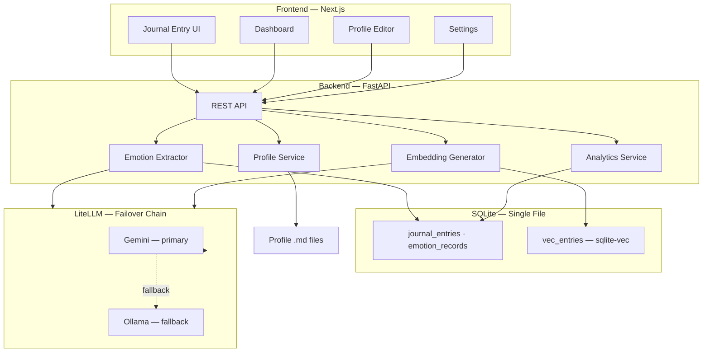
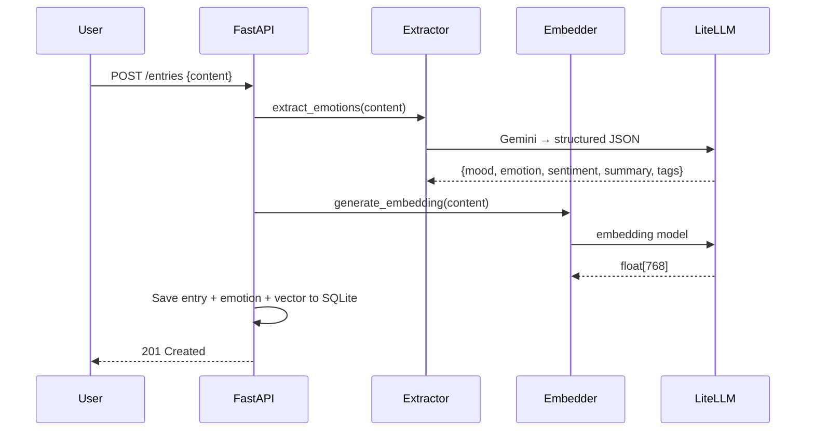
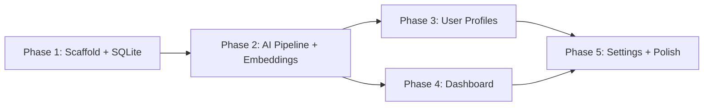

# AI Cognitive Journal — Implementation Plan (v3)

A local-first application that automates journaling, extracts emotional patterns via AI, and provides actionable insights. All data stays on the user's machine.

---

## Tech Stack

| Layer | Technology | Rationale |
|---|---|---|
| **Backend** | **FastAPI** (Python) | Async, auto OpenAPI docs, great AI/ML ecosystem |
| **Database** | **SQLite** + **sqlite-vec** | Single-file DB + vector search in one process. No Docker, no extra infra — perfect for local-first |
| **Frontend** | **Next.js 15** + shadcn/ui + Tailwind CSS | Premium UI, server components, great DX |
| **LLM** | **LiteLLM** → Gemini (primary) + Ollama (fallback) | Single interface, automatic fallback chain |
| **Embeddings** | **LiteLLM** (embedding API) | Same unified interface for text → vector |
| **Visualization** | **Recharts** | Native React chart components |

---

## Why sqlite-vec over Qdrant?

| Factor | sqlite-vec | Qdrant (Docker) |
|---|---|---|
| **Infra** | Zero — lives inside your SQLite file | Requires Docker daemon running |
| **Local-first** | ✅ Perfect fit — single portable file | ❌ Separate service to manage |
| **Scale needed** | ~thousands of journal entries | Built for millions+ |
| **Simplicity** | One DB for everything | Two separate data stores to sync |
| **Future chat/RAG** | Vector search ready from day one | Same capability but heavier |

> [!NOTE]
> **Decision: sqlite-vec.** For a personal journal with thousands of entries, sqlite-vec gives us vector similarity search (needed for future chat/RAG) without any infrastructure overhead. Every journal entry gets embedded and stored alongside its relational data in the same SQLite file. When chat is added later, we just query `SELECT * FROM vec_entries ORDER BY distance(embedding, ?) LIMIT k`.

---

## Architecture



---

## Data Models

```python
# journal_entries — stores the original user log
class JournalEntry:
    id:         int          # PK
    content:    str          # ✅ Original raw user log (never modified)
    created_at: datetime
    updated_at: datetime

# emotion_records — AI-extracted structured data (1:1 with entry)
class EmotionRecord:
    id:         int
    entry_id:   int          # FK → journal_entries
    mood:       str          # "happy", "anxious", "calm"
    emotion:    str          # "gratitude", "frustration", "hope"
    sentiment:  float        # -1.0 to 1.0
    summary:    str          # AI one-line summary
    tags:       str          # JSON array: ["work", "health"]
    created_at: datetime

# vec_entries — sqlite-vec virtual table (for future chat/RAG)
# Stores embedding vectors alongside entry_id for similarity search
```

> [!TIP]
> Embeddings are generated and stored **from day one** even though chat isn't implemented yet. This means when chat/RAG is added later, the entire journal history is already searchable — zero backfilling needed.

---

## Proposed Changes

### Phase 1 — Scaffolding & Database

#### [NEW] `backend/` — FastAPI project

| File | Purpose |
|---|---|
| `backend/main.py` | FastAPI app, CORS, router registration |
| `backend/config.py` | Pydantic Settings: DB path, Gemini key, Ollama URL |
| `backend/database.py` | SQLite engine, sqlite-vec extension loading, sessions |
| `backend/models/journal.py` | `JournalEntry` SQLAlchemy model |
| `backend/models/emotion.py` | `EmotionRecord` SQLAlchemy model |
| `backend/schemas/` | Pydantic request/response schemas |
| `backend/routers/journal.py` | `POST /entries`, `GET /entries`, `GET /entries/{id}`, `DELETE` |
| `backend/requirements.txt` | Dependencies |

#### [NEW] `frontend/` — Next.js project

| File | Purpose |
|---|---|
| `frontend/src/app/layout.tsx` | Root layout, dark theme, Inter font |
| `frontend/src/app/page.tsx` | Journal entry page |
| `frontend/src/lib/api.ts` | Fetch wrapper for FastAPI |

---

### Phase 2 — AI Pipeline (Emotion Extraction + Embeddings)

#### [NEW] `backend/agent/`

| File | Purpose |
|---|---|
| `llm_client.py` | LiteLLM wrapper — Gemini primary, Ollama fallback |
| `prompts.py` | Extraction prompt templates (structured JSON output) |
| `extractor.py` | `extract_emotions(text) → EmotionRecord` |
| `embedder.py` | `generate_embedding(text) → vector` → stored in sqlite-vec |

**Extraction Flow:**


---

### Phase 3 — User Profile System

#### [NEW] `backend/routers/profile.py`
- `GET /profile/{type}` — read `personality.md`, `goals.md`, or `vision.md`
- `PUT /profile/{type}` — update content
- `POST /profile/generate` — AI generates profile section from journal history

#### [NEW] `frontend/src/app/profile/page.tsx`
- Tabbed markdown editor with live preview
- "Generate with AI" button per section

#### [NEW] `backend/data/profiles/`
- `personality.md` · `goals.md` · `vision.md`

---

### Phase 4 — Visualization Dashboard

#### [NEW] `backend/routers/analytics.py`
- `GET /analytics/sentiment?range=7d` — daily sentiment averages
- `GET /analytics/emotions?range=30d` — emotion frequency
- `GET /analytics/tags` — topic distribution
- `GET /analytics/streak` — journaling streak

#### [NEW] `frontend/src/app/dashboard/page.tsx`

| Visualization | Chart Type |
|---|---|
| Sentiment over time | Area chart |
| Emotion breakdown | Bar / Radar chart |
| Topic distribution | Tag cloud |
| Journaling streak | Calendar heatmap |
| AI weekly summary | Card |

---

### Phase 5 — Settings & Polish

#### [NEW] `frontend/src/app/settings/page.tsx`
- Gemini API key input
- Ollama URL configuration
- Data export (JSON / Markdown)
- Theme toggle

#### [MODIFY] All pages
- Sidebar navigation, responsive layout, micro-animations, loading skeletons

---

## Project Structure

```
AI Journal Idea/
├── backend/
│   ├── main.py
│   ├── config.py
│   ├── database.py
│   ├── models/
│   │   ├── journal.py
│   │   └── emotion.py
│   ├── schemas/
│   │   ├── journal.py
│   │   └── emotion.py
│   ├── routers/
│   │   ├── journal.py
│   │   ├── profile.py
│   │   └── analytics.py
│   ├── agent/
│   │   ├── llm_client.py
│   │   ├── prompts.py
│   │   ├── extractor.py
│   │   └── embedder.py
│   ├── data/
│   │   ├── profiles/
│   │   │   ├── personality.md
│   │   │   ├── goals.md
│   │   │   └── vision.md
│   │   └── journal.db          # SQLite + sqlite-vec (single file)
│   └── requirements.txt
├── frontend/
│   ├── src/
│   │   ├── app/
│   │   │   ├── layout.tsx
│   │   │   ├── page.tsx
│   │   │   ├── dashboard/page.tsx
│   │   │   ├── profile/page.tsx
│   │   │   └── settings/page.tsx
│   │   ├── components/
│   │   └── lib/api.ts
│   ├── package.json
│   └── components.json
├── plan.md
└── README.md
```

---

## Extensibility for Future Chat

The architecture is **chat-ready** without implementing chat now:

| What we build now | What chat needs later |
|---|---|
| Embeddings stored for every entry (sqlite-vec) | `POST /chat` route that queries similar entries |
| Profile [.md](file:///c:/Projects/AI%20Journal%20Idea/plan.md) files loaded as context | Inject profile into LLM system prompt |
| LiteLLM client with fallback chain | Reuse same client for conversational queries |
| Emotion/tag data structured in DB | Filter context by mood, date, tags |

> Adding chat later = **~1 new router + 1 new frontend page**. No schema changes, no re-embedding.

---

## Build Order



---

## Verification Plan

### Automated Tests
```bash
cd backend && pytest tests/ -v
cd frontend && npm test && npx playwright test
```

### Manual Verification
1. **Entry flow:** Create entry → verify original log preserved + AI fields populated + embedding stored
2. **Fallback:** Disable Gemini key → verify Ollama picks up automatically
3. **Dashboard:** After 5+ entries, verify all charts render with real data
4. **Profile:** Edit Goals.md → verify AI references updated goals in extraction context
5. **Portability:** Copy `journal.db` to another machine → verify all data intact
